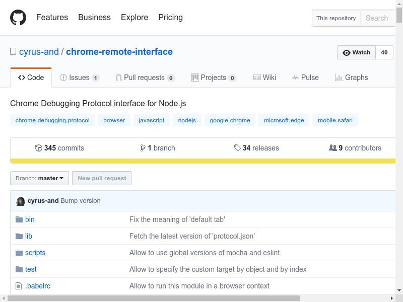

# try to take screenshots with chrome-remote-interface

```
$ uname -a
Linux ksuda-XPS-13-9360 4.4.0-62-generic #83-Ubuntu SMP Wed Jan 18 14:10:15 UTC 2017 x86_64 x86_64 x86_64 GNU/Linux
$ google-chrome --version
Google Chrome 57.0.2987.133
$ yarn install
$ yarn start
yarn start v0.19.1
$ node main.js
https://github.com/cyrus-and/chrome-remote-interface
https://assets-cdn.github.com/assets/frameworks-223154a4264e621d49411c69fd71062cb152480ce2de3bde5ae285e801db7185.css
https://assets-cdn.github.com/assets/github-11c46449861d69b02a101da2d9e4232e7213635a4d2839dde7e30604f59cf718.css
https://assets-cdn.github.com/assets/site-d826c765b656f31c7d808168e332aa14ccb724820f292ecd2dfb74b156e2ebde.css
https://avatars1.githubusercontent.com/u/1660263?v=3&s=40
https://assets-cdn.github.com/images/spinners/octocat-spinner-32.gif
https://camo.githubusercontent.com/a5d6d07ad2e87ccccca2a5c98df77c143589329b/68747470733a2f2f7472617669732d63692e6f72672f63797275732d616e642f6368726f6d652d72656d6f74652d696e746572666163652e7376673f6272616e63683d6d6173746572
https://assets-cdn.github.com/assets/compat-8a4318ffea09a0cdb8214b76cf2926b9f6a0ced318a317bed419db19214c690d.js
https://assets-cdn.github.com/assets/frameworks-6d109e75ad8471ba415082726c00c35fb929ceab975082492835f11eca8c07d9.js
https://assets-cdn.github.com/assets/github-225a22ae2420e34ab23c6a4131040d17c0ceaf223392ec557641a8412e391a23.js
https://collector.githubapp.com/github/page_view?dimensions[page]=https%3A%2F%2Fgithub.com%2Fcyrus-and%2Fchrome-remote-interface&dimensions[title]=GitHub%20-%20cyrus-and%2Fchrome-remote-interface%3A%20Chrome%20Debugging%20Protocol%20interface%20for%20Node.js&dimensions[referrer]=&dimensions[user_agent]=Mozilla%2F5.0%20(X11%3B%20Linux%20x86_64)%20AppleWebKit%2F537.36%20(KHTML%2C%20like%20Gecko)%20HeadlessChrome%20Safari%2F537.36&dimensions[screen_resolution]=800x600&dimensions[pixel_ratio]=1&dimensions[browser_resolution]=800x600&dimensions[tz_seconds]=32400&dimensions[timestamp]=1492350657159&dimensions[request_id]=E020%3A281EA%3A5BB8D94%3A94DE02B%3A58F376C0&dimensions[user_id]=1660263&dimensions[user_login]=cyrus-and&dimensions[repository_id]=9503997&dimensions[repository_nwo]=cyrus-and%2Fchrome-remote-interface&dimensions[repository_public]=true&dimensions[repository_is_fork]=false&dimensions[repository_network_root_id]=9503997&dimensions[repository_network_root_nwo]=cyrus-and%2Fchrome-remote-interface&&measures[performance_timing]=1-425-8--1129-1128-1128-735-8-1-0---0---426-843-723-214-728-728&&&dimensions[cid]=2006830082.1492349352
https://www.google-analytics.com/collect
https://api.github.com/_private/browser/stats
Image saved as screenshot-1492350658070.png
Done in 2.58s.
```


